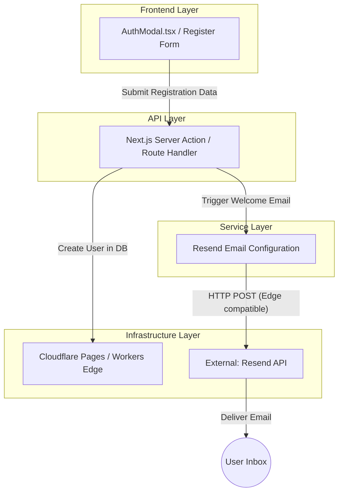
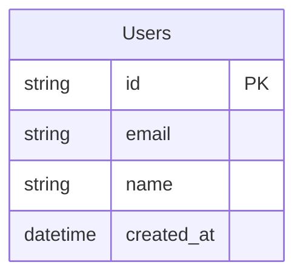

# Introduction


This plan outlines the implementation of an automated email sent via Resend whenever a new user registers on the platform. The application runs on Cloudflare's free tier, using the domain `qaldas.com`.

## 1. Requirements & Constraints

- **REQ-001**: Send an automated welcome/confirmation email upon successful user registration.
- **REQ-002**: Integrate with the Resend API using the custom domain `qaldas.com`.
- **CON-001**: System is hosted on Cloudflare's free tier, so the solution must be edge-compatible (e.g., Cloudflare Workers/Pages CPU and API constraints apply).
- **SEC-001**: Securely store Resend API keys using Cloudflare Secrets (or Next.js env vars) without exposing them to the client.
- **CON-002**: Must use asynchronous processing or an edge-compatible fetch request so we don't unduly delay the UI response during the registration flow.

## 2. Implementation Steps

### Implementation Phase 1: Environment & Domain Setup

- GOAL-001: Configure the domain `qaldas.com` in Resend and correctly set up Cloudflare environment variables.

| Task | Description | Completed | Date |
|------|-------------|-----------|------|
| TASK-001 | Add `qaldas.com` domain in the Resend dashboard. | | |
| TASK-002 | Verify the domain by adding DKIM/SPF DNS records in Cloudflare's DNS settings. | | |
| TASK-003 | Generate a Resend API Key. | | |
| TASK-004 | Add `RESEND_API_KEY` to local `.env.local` and Cloudflare Pages/Workers secrets. | | |

### Implementation Phase 2: Email Service Integration

- GOAL-002: Create the email sending logic and integrate it reliably into the registration flow.

| Task | Description | Completed | Date |
|------|-------------|-----------|------|
| TASK-005 | Install the `resend` package using `pnpm add resend`. | | |
| TASK-006 | Create an email template component (e.g., `components/emails/WelcomeEmail.tsx` or raw HTML). | | |
| TASK-007 | Update the server-side registration logic (e.g., Next.js Server Action or Route Handler) to trigger `resend.emails.send(...)` upon successful user creation. | | |
| TASK-008 | Enhance `AuthModal.tsx` to handle the successful registration state and notify the user to check their email. | | |

## 3. Technical Considerations

### System Architecture Overview



- **Technology Stack Selection**: Next.js (App Router), React, Cloudflare Pages on Edge, Resend for transactional emails. Resend is chosen due to its modern developer experience, React Email support, and generous free tier.
- **Integration Points**: Resend API endpoint (`https://api.resend.com/emails`).
- **Scalability Considerations**: Cloudflare edge functions scale automatically. Resend effectively handles high-volume email delivery without maintaining an SMTP server.

### Database Schema Design

*No structural modifications to the database layer are strictly required for the core email sending logic, assuming a User table and authentication logic already exists.*



### API Design

- **Endpoint**: Next.js Server Action or a POST handler (e.g., `app/api/auth/register/route.ts`).
- **Logic Sequence**: 
  1. Validate incoming user input (email, password conformity).
  2. Create the user entity within the database.
  3. Call the Resend API:
     ```ts
     import { Resend } from 'resend';
     const resend = new Resend(process.env.RESEND_API_KEY);
     
     // Called asynchronously
     await resend.emails.send({
       from: 'Acme <onboarding@qaldas.com>',
       to: [userEmail],
       subject: 'Welcome to Qaldas!',
       html: '<p>Thanks for joining Qaldas.</p>',
     });
     ```

### Frontend Architecture

**Component Update**: `app/components/AuthModal.tsx`
- Implement UI feedback post-registration indicating an email has been dispatched (e.g., a toast notification or dedicated success message within the modal).
- Ensure error boundaries handle edge cases (e.g., email delivery failures) gracefully without failing the entire user session.

### Security Performance

- **Secrets Management**: `RESEND_API_KEY` must absolutely be kept within server walls and propagated properly to Cloudflare Pages/Workers secrets.
- **DNS/Domain Auth**: Proper DNS records in Cloudflare (TXT, SPF, DKIM) prevent the delivered emails from ending up in spam.
- **Input Validation**: Strictly validate email shape via Zod or similar before passing payloads to Resend to prevent bouncing penalties or API errors.

## 4. Alternatives

- **ALT-001**: **SendGrid / Mailgun**: Not chosen as Resend provides a vastly superior developer experience, specifically geared toward React/Next.js integrations, alongside a robust free tier.
- **ALT-002**: **Cloudflare Email Routing**: Primarily routing and forwarding. Does not allow for outbound transactional email sending via API.

## 5. Dependencies

- **DEP-001**: `resend` npm package.
- **DEP-002**: (Optional) `react-email` or `@react-email/components` if planning to construct highly complex dynamic email templates.

## 6. Testing

- **TEST-001**: Manually test the registration flow locally. Ensure the Resend API receives the payload cleanly without edge middleware errors, and an email hits a test inbox.
- **TEST-002**: Verify edge compatibility of the `resend` SDK during a Cloudflare preview deployment.

## 7. Risks & Assumptions

- **RISK-001**: The `resend` SDK might invoke node-specific APIs incompatible with Cloudflare's Edge Runtime. *Mitigation: The latest Resend SDK uses standard `fetch` under the hood natively supporting Edge runtimes. However, if problems arise, fallback to a raw `fetch` call against `https://api.resend.com/emails`.*
- **ASSUMPTION-001**: The domain `qaldas.com` DNS is managed within the same or closely related Cloudflare account, expediting the addition and propogation of domain verification records.
